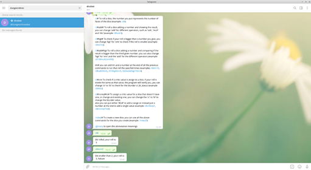

# DungeonDicesBot

> This is a capstone project for Microverse, it is a bot for telegram who roll different type of dices, it has different options like comparing the rolls to a number or do some maths

## Built With

- Ruby
- Botfather
- Rspec
- Heroku
- Atom
- Rubocop

## Check the bot yourself!

[Find it here:](https://livedemo.com)

## Getting Started

**Open Telegram and look for DungeonDicesBot**
**Start the bot and type /help to see all the commands, it as different options**
**The only requisite is to have Telegram**

## Authors

👤 **Johann Rodríguez**
- Github: [@JohannRodriguez](https://github.com/JohannRodriguez)
- Twitter: [@BSapce](https://https://twitter.com/BSapce)
- Linkedin: [Johann Rodríguez](https://www.linkedin.com/in/johann-alonso-rodr%C3%ADguez-v%C3%A1zquez-25b07719a/)

Contributions, issues and feature requests are welcome!

Feel free to check the [issues page](https://github.com/JohannRodriguez/DungeonDicesBot-ruby-capstone/issues).

## Show your support

Give a ⭐️ if you like this project!

## 📝 License

This project is [MIT](lic.url) licensed.
